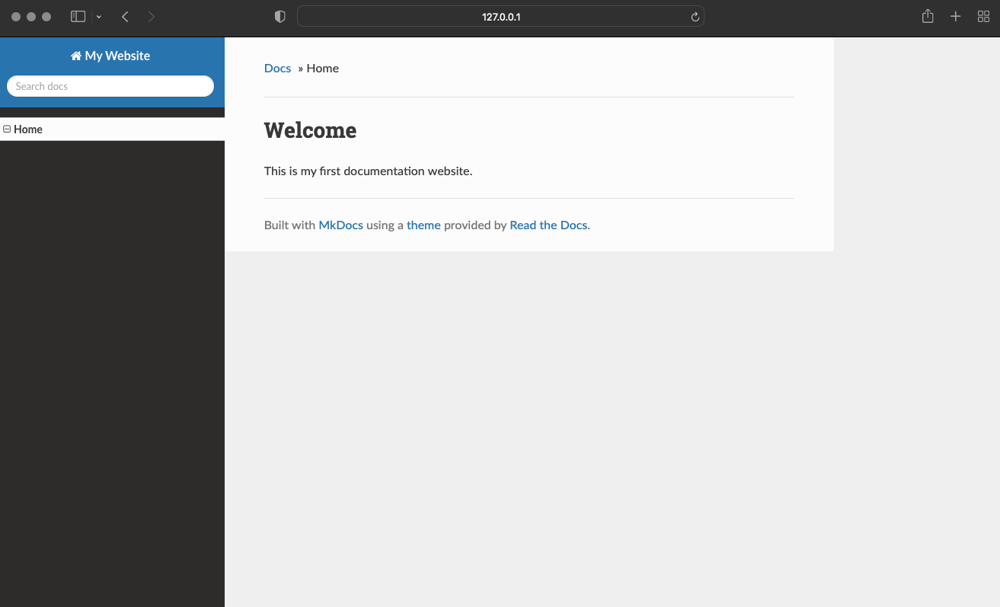

# Launching the Website Locally

**Before you begin:** Ensure that:

* You have MkDocs installed on your computer. See [Installing MkDocs](install_mkd.md).
* You have Python installed on your computer.
* Your project contains all necessary files. See [Verifying Project Files](project_files.md).

**Procedure:**

1. In the root location of your project, in the terminal, run: `mkdocs serve`.
2. In your default web browser, open [http://127.0.0.1:8000](http://127.0.0.1:8000).

If you use the configuration provided in the "Setting Up the Website" section, the following website appears:

