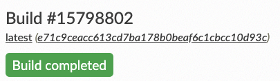

# Publishing the Website

**Procedure:**

1. In your default web browser, open the [Read the Docs dashboard](https://readthedocs.org/dashboard/).
2. In the **Projects** box, click the project you want to publish.
3. On the **Project** site, click **Build version**.

    **Result:** Building and publishing process begins. When it is complete, a message appears 

    

4. Click **View Docs** to open the published website.

You can view the website and be proud of yourself — you have successfully created a website and published it worldwide. :rainbow:
