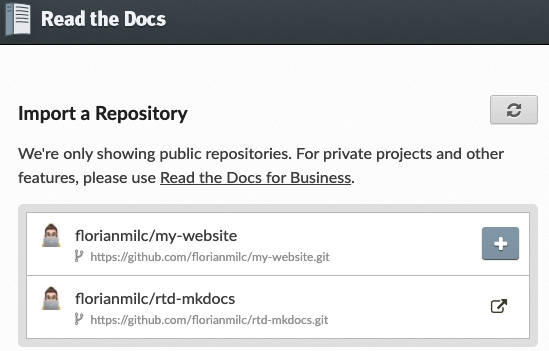

# Importing Project to Read the Docs

**Before you begin:** Ensure that:

* You have all necessary project files. See [Verifying Project Files](project_files.md).
* The project files are located on the repository of your choice.
* You have an account on Read the Docs. See [Creating Account on Read the Docs](rtd_signup.md).

**Procedure:**

1. In your default web browser, open the [Read the Docs Dashboard](https://readthedocs.org/dashboard/).
2. **Optional:** At the prompt, click the on-screen instructions to log on to the website.
3. On the **Import a Repository** site, click  appearing to the right of the project you want to import.   

4. **Optional:** If you cannot see the project you want to import on the list of available projects, perform the following actions:
    1. Click  to refresh the list. 
    2. When the project you want to import appears on the list, click  to import it.
5. On the **Project Details** website, ensure all the settings are correct, and click **Next**.

**Result:** The **Projects** website appears with the name of your project and a message that webhook is successfully added.