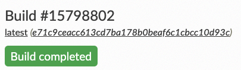

# Publishing the Website

**Before you begin:** Ensure that you imported your project to Read the Docs. See [Imporing Project Files](rtd_import_project.md).

1. In your default web browser, open the [Read the Docs dashboard](https://readthedocs.org/dashboard/).
2. In the **Projects** box, click the project you want to publish.
3. On the **Project** site, click **Build version**.

    **Result:** Building and publishing process begins. When it is complete, a message appears informing that the build is complete.

  
4. Click **View Docs** to open the published website.

If the website loads, that is awesome — you successfully created your website and published it worldwide. :rainbow: